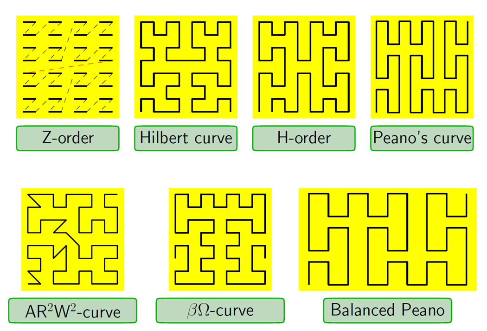
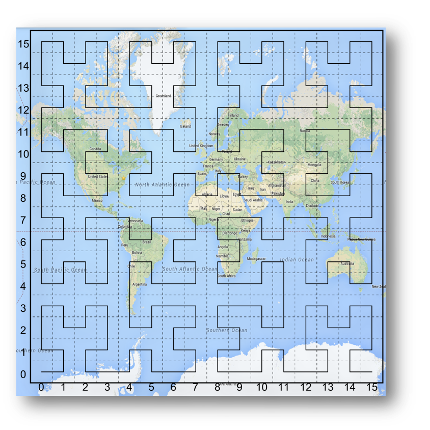

# Theory

## Spatial Index
The core of the issue is that we need to represent multi-dimensional data (could be (latitude, longitude), (latitude, longitude, time), (latitude, longitude, altitude, time) – or even (feature vector1, feature vector 2 (…) feature vector n)) in a manner that can be reduced to a series of ranges on a 1 dimensional number line.   This is due to the way accumulo (and any big table based database really) stores the data – as a sorted set of key/value pairs.   

What we want is a property that ensures values close in n-dimensional space are still close in 1-dimensional space.   There are a few reasons for this – but primarily it’s so we can represent a n-dimensional range selector(bbox typically – but can be abstracted to a hyper-rectangle) as a smaller number of highly contiguous 1d ranges.   

*Figure: Z-Order curve based dimensional decomposition*

Fortunately there is already a type of transform that describes this operation in mathematics – it’s called a   “Space Filling Curve” – or SFC for short.   Different space filling curves have different properties  - what they all do is take a n-dimensional space and describe a set of steps to trace all points in a single sequence.  

*Figure: Haverkort, Walderveen Locality and Bounding-Box Qualifty of Two-Dimensional Space-Filling Curves 2008 arXiv:0806.4787v2*

The trade-offs for the various curves are outside the scope of this user manual, but the paper cited for figure two is an excellent starting point to start learning about these curves.   

For the purposes of GeoWave we have implemented two space fillings curves:

### Z-Order SFC
This is also commonly called a GeoHash, or Morton order (and sometimes incorrectly called a Peano curve).   This is the most popular SFC used for muti-dimensional -> 1-dimensional mappigns – primarily because it is both intuitive and  very easy to implement in code.   There are two common ways to implement this – ideally a bit-interleaving is used (that is what gives rise to the diagram in figure 2) – imagine we had two numbers, A and B.  Let the binary representation of those numbers be   A1A2A3 and B1B2B3.  The “bit interleaved” version would be  A1B1A2B2A3B3.  Since we are working with binary numbers this gives a “unit cell” of 2x2.  If we added dimensions just image the same interleaving, but another term - C1C2C3, etc.    
This is sometimes implemented in base 10 instead of base 2.    This implementation reduces somewhat the locality (“packing property” – or the measure of how close numbers in n-dimensional space are to numbers in 1-dimensional space).   As you might expect a two dimensional version of this gives a unit cell of 10x10  (for two dimensions) – hence the worse packing.    

### Hilbert SFC
The Hilbert curve is a bit more complex to work with than the Z-curve – both when calculating and when performing a decomposition – hence it is less commonly used.   Nevertheless it is popular in other areas in computer science where multiple variables  need to be set in a linear order – process scheduling for one.   A simplistic view of a standard projections of the earth mapped to a Hilbert curve would look something like this – with 4 bits of cardinality per dimension (how many buckets we have)

*Figure: Hilbert space filling curve superimposed over a projection of the earth*

Note that there are the cardinality (number of buckets per dimensions) has an impact on the resolution of our Hilbert index.  Here we map from -180 to +180 over 16 buckets – so we have resolution of no better than 360/16, or 22.5 degrees for longitude (and incidentally 11.25 degrees for latitude).   This doesn’t mean we can’t represent values more precisely than this – it just means our initial (coarse) index – based on SFC ranges – can’t provide resolution any better than this.   Adding more bits per dimensions will increase the precision of the SFC based index.   

